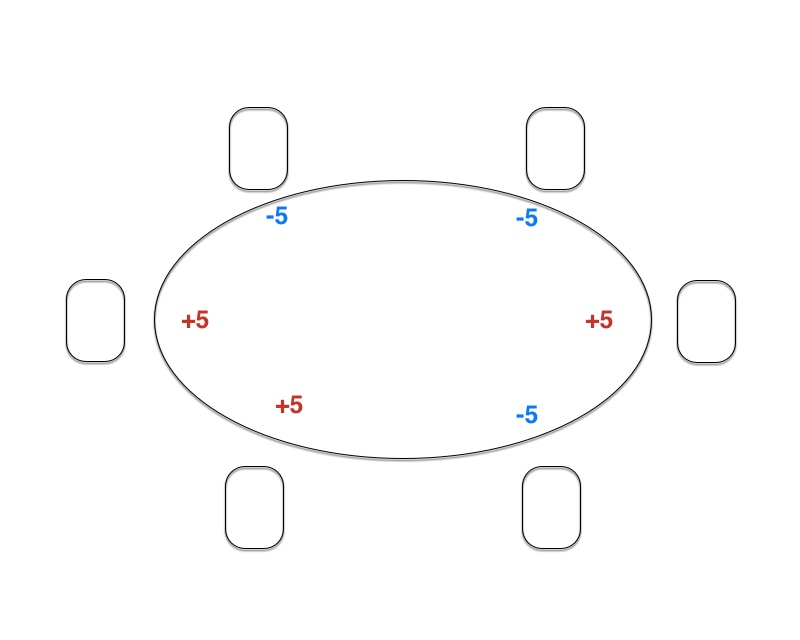
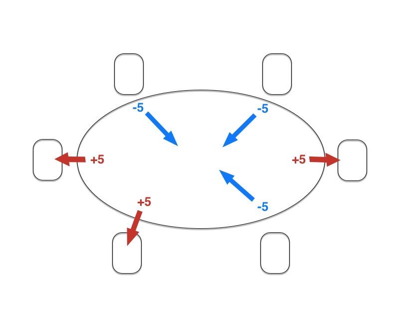
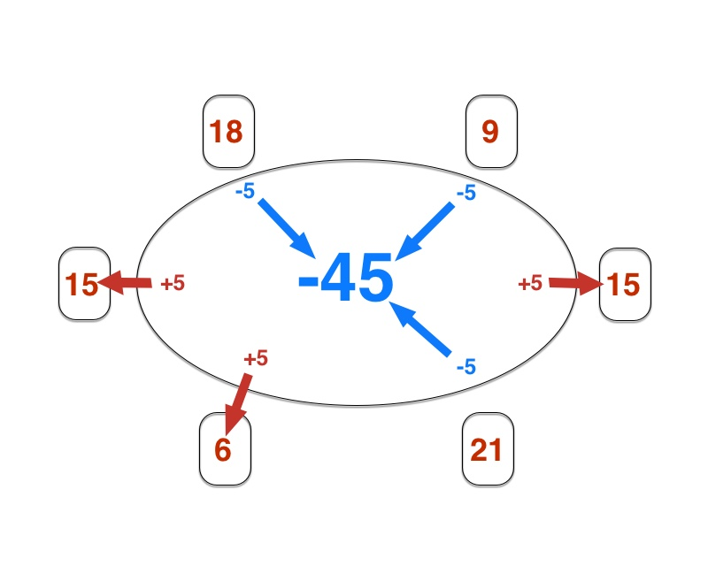
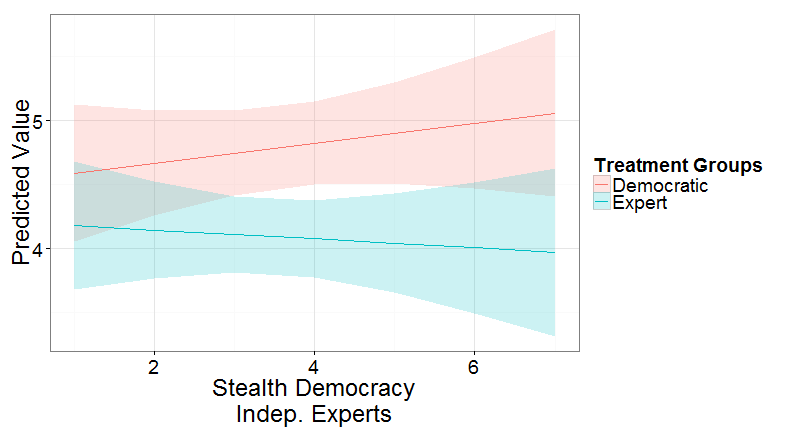
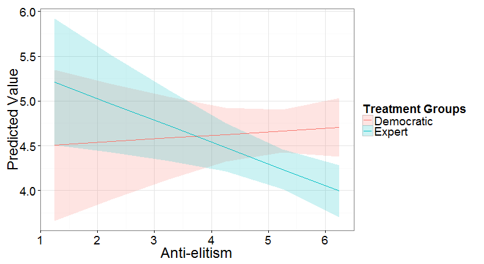
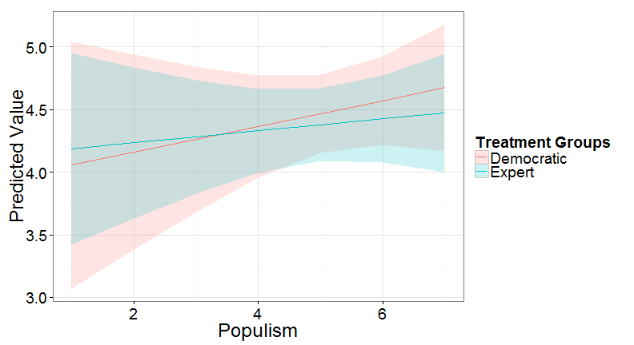

## Introduction
1. Emergence of technocratic governments after the 2008 global economic crisis -> Importance of legitimacy of policies issued by technocrats.
2. Empirical ambiguity: 
  - Criticism in public discourse
  - High initial popularity
  - Dramatic declines in support
3. Theoretical ambiguity: 
  - Formally/legally democratic, but loosen informal ties of legitimacy. (Pastorella 2015)
  - Both popular involvement and high decision-maker competence may legitimize a policy. 
  - No research on their comparative effects. 

Research Question: Are decisions made by an expert are more accepted than decisions passed by popular vote? 

---
## Characteristics of an "ideal" technocratic government 
1. All major governmental decisions are not made by elected party officials
2. Policy is not decided within parties which then act cohesively to enact it.
3. The highest officials (ministers, prime ministers) are not recruited through parties.  
(Macdonell and Valbruzzi 2014, p 656)

---
## Recent examples of technocratic rule

---
## Expectations 1. Standard democratic theory
  - "the normative legitimacy of a democratic decision depends on the degree to which those affected by it have been included in the decision-making process" (Young, 2000) 
  - Involving people in decision-making increases the compliance to laws (Tyler 1994).
  
Hypothesis 1. A policy passed by means of direct democracy (e.g. popular vote) will be more legitimate than a policy passed by a technocrat. 

---
## Expectations 2. Alternative theories 
  - Stealth Democracy: People prefer less deliberation, popular involvement than we usually assume, ideally people expect leaders to contribute to the common good in a non-self-interested-manner. (Hibbing & Theiss-Morse, 2002)
  - Candidate evaluation literature: competence is an important trait in leaders. (Littlepage et al 1997, Todorov et al 2005)

Hypothesis 1.A A policy passed by a technocrat will be more legitimate than a policy passed by means of direct democracy.

---
## Study 1 - Design

Participants: 198 Hungarian students at the CEU Computer Lab

---
## Study 1 - Design

Participants: 198 Hungarian students at the CEU Computer Lab

---
## Study 1 - Design

Participants: 198 Hungarian students at the CEU Computer Lab

---
## Study 1 - Design

Participants: 198 Hungarian students at the CEU Computer Lab

---
## Study 1 - Design

---
## Study 1 - Result

 
Participants in the expert group evaluated significantly and substantially more preferably the new rule on each variable.

--- bg:#2f4f4f
## Study 1 provides support for Hypothesis 1.A: 
## A policy passed by a technocrat is more legitimate than a policy passed by means of direct democracy 

---
## Study 2 - Results 

 
Participants in the expert condition considered the rule to be significantly less fair and marginally more negative on their subjective performance.

--- bg:#2f4f4f
## Study 2 provides support for Hypothesis 1: 
## A policy passed by means of direct democracy (e.g. popular vote) is more legitimate than a policy passed by a technocrat.  

---
## Expectations 3. Mediators 

Individual political preferences mediate the effect of legitimation procedure on the acceptance of a policy.

  - Hypothesis 2.A. People more in favour of rule by independent experts will find the policy by a technocrat to be more legitimate.

  - Hypothesis 2.B. People with higher anti-elitist sentiments will find the policy by a technocrat to be less legitimate.

  - Hypothesis 2.C. People higher on support for direct democracy will find the policy by a technocrat to be less legitimate.

Social psychology suggests that source competence may be a cue for persuasiveness of a statement (Petty and Cacioppo 1984)

  - Hypothesis 3. People relying more on cues will find the policy by a technocrat to be more legitimate

---
## Study 2 - "Stealth Democracy"

 

Support for independent experts does not mediate the effect of type of decision making. 

---
## Study 2 - "Anti-Elitism"

 

In line with our expectation, elitists considered the rule introduced by experts as preferable, whereas anti-elitists vice versa.

---
## Study 2 - "Populism"

 

Contrary to our expectation, support for direct democracy did not have a significant effect on the evaluation of the legitimation procedure. 

--- bg:#2f4f4f
## Study 2 provides limited support for H2. 
## Some values (elitism) mediate the effect of decision-making procedure whereas others (stealth democracy, populism) do not. 
## Identifying the relevant values requires further research. 

---
## Study 2 - "Cognitive Reflection Test"

 

The results of the model support our expectations: people who rely more on cues consider the expert-rule to be more fair. The evaluation of democratic-rule is constant.

--- bg:#2f4f4f
## Study 2 supports H3: 
## Decisions made by technocrats is relied on as a positive cue and leads to evaluations as high as in the democratic condition. 

---
## Conclusions

1. Does Democracy Matter? For some, at least!
2. Procedure of implementing austerity has a substantial effect on perception of austerity measures. 
3. A lot of heterogeneity in the data. -> More research is needed to explain it. 
4. Importance of behavioral paradigm: measuring actual versus hypothetical attitudes. 

---
## Appendix 1. Experimental approach

Our hypothesis is difficult to test with observational data:  
- Confounders: Perception of the state of economy might influence both acceptance of austerity and the type of government preferred.
- Counterfactuals: Large variation between austerity measures, hard to compare countries or times with and without technocrats. 
- Reverse causality: High discontent for austerity might prompt the appointment of technocratic government.
- Practical data issues: aggregate data on popularity vs. micro-level hypothesis on acceptance of policies

--- &twocol 
## Appendix 2. Study 1 - Detailed design 
*** =left
  
- People voted if they preferred a risky (+5/-5) or a conservative (+3/-2) rule for allocating points.

*** =right 
- After some time the game was interrupted to alert participants of a potential crisis. A redustributive solution was introduced through a new vote, or through an expert's intervention.  
- The quiz was interrupted again to evaluate the new rule in terms of its fairness, effectiveness and effect on subjective performance (Eval 1.)
- Finally, after revealing that there had been another treatment group participants evaluated the alternative procedure. (Eval 2.)

--- &twocol
## Study 2 - Detailed Design

*** =left 
  
- Participants: 646 U.S. adults from 46 states on Amazon's Mechanical Turk
- Adapting Experiment 1 to an online interface
- Incentive: Collecting tokens, which at the end determine the amount of reimbursement.

*** =right
- Vote about collecting negative points together or not (rather than points)
- 2x2 factorial design with legitimation procedure and solution as the two treatments
- Two types of solution: Collectivist - redistributing some of the individually earned positive points. Individualist - dividing common negative account between participants and allowing those an overall negative balance to go bankrupt. 
